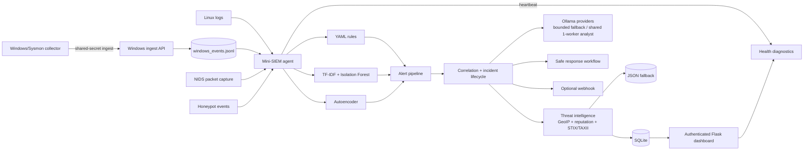
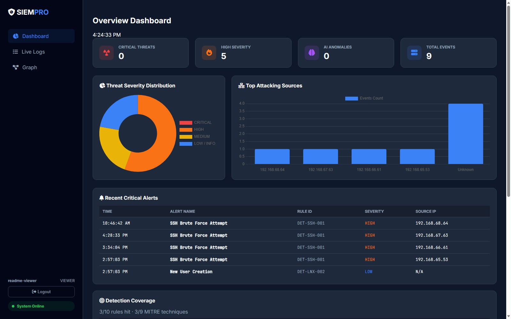

# Mini-SIEM Pro — AI-Assisted Blue Team Lab


[](https://github.com/zenniskayy2k4/Mini-SIEM/actions/workflows/ci.yml)

A compact, explainable SIEM lab for learning blue-team workflows. It combines YAML signatures, local anomaly models, event correlation, an optional Ollama Cloud analyst, an authenticated incident dashboard, and safe response simulation.

> **Educational use only.** Run it only on systems and networks you own or are authorized to monitor. It is not a production EDR, firewall, or replacement for a staffed SOC.

Current release: **v0.7.0** — see the [changelog](CHANGELOG.md) and [release checklist](docs/RELEASE_v0.7.0.md).

## What is implemented

- Native YAML and supported Sigma detection rules with MITRE ATT&CK mappings and reloadable rule state.
- CI-backed baseline, Docker smoke, security, and release gates.
- HIDS log monitoring, Linux-oriented packet capture, honeypot events, and multi-event correlation.
- Offline Windows/Sysmon import plus authenticated collector ingestion.
- TF-IDF/Isolation Forest and autoencoder anomaly signals alongside deterministic rules.
- Ollama Cloud or optional local triage through one shared worker and bounded fallback; detection continues while AI is busy or unavailable.
- SQLite as the primary alert store, with JSON dual-write/fallback during migration.
- Admin-only asset inventory with validated CRUD, hostname/IP lookup, alert links, filters, criticality, ownership, tags, and immutable audit events.
- Incident lifecycle, notes, assignee, timeline, audit trail, role-based access, and CSRF protection.
- Role-focused workspaces: read-only viewer KPIs, analyst investigation queues, and an admin control/status workspace.
- Proposed response actions, approvals, simulation, rollback metadata, and optional webhook notifications.
- Normalized GeoIP, optional AbuseIPDB/VirusTotal metadata, and offline STIX/TAXII indicator matching.
- Health/status diagnostics, retention, SQLite backup, and log rotation tooling.
- Deterministic detection scenarios, analyst feedback, audited tuning controls, versioned event envelopes, ingestion diagnostics, and stale-collector detection.

## Architecture



The dashboard and agent share mounted `data/`, `logs/`, `models/`, and read-only rule files when run with Docker Compose.

## Detection and severity model

The local detector remains authoritative. AI enrichment never silently rewrites the alert's `severity`.

| Local evidence | System decision |
|---|---|
| YAML rule plus both local ML signals | `CRITICAL` |
| YAML rule plus one local ML signal | Keep the rule severity and annotate the supporting signal |
| No rule, both local ML signals, confidence at least 40 | `CRITICAL` |
| No rule, one local ML signal | `HIGH` |

Ollama adds separate decision-support fields:

- `ai_recommended_severity` and `ai_disposition`, without changing `severity`.
- `escalate_to_human=true` recommends `CRITICAL` and human review.
- A high-confidence false-positive assessment (`fp_confidence >= 80`) recommends `LOW` with `FALSE_POSITIVE_SUSPECTED`; an analyst still makes the final decision.

## Quick start with Docker

Requirements: Docker Desktop with Compose, Git, and enough resources to run the local models. Ollama Cloud is optional.

```bash
git clone <repository-url>
cd Mini-SIEM
cp .env.example .env
docker compose --profile train run --rm train
docker compose up -d
```

Create the first dashboard administrator. The command prompts securely when `DASHBOARD_USER_PASSWORD` is not set:

```bash
docker compose exec dashboard python tools/manage_dashboard_user.py admin admin
```

Open <http://localhost:5000>, then sign in. Check service state with:

```bash
docker compose ps
curl http://localhost:5000/health
```

Prometheus can scrape `GET /metrics`. Set `METRICS_BEARER_TOKEN` in `.env` and send `Authorization: Bearer <token>` outside an isolated local lab; an empty token leaves the endpoint unauthenticated. Restrict it at the firewall or reverse proxy because the endpoint is intentionally exempt from dashboard session login. Metrics expose only bounded labels such as severity, incident status, rule ID/source, provider, and result—never raw IPs, usernames, secrets, or payloads.

Authenticated dashboard users can query `GET /api/analytics/kpis?from=<ISO-8601>&to=<ISO-8601>` for a half-open detection-time range of at most 366 days; the default is the last 24 hours. MTTD measures observed `timestamp` to alert `created_at`, MTTA measures incident creation to the first analyst workflow event, and MTTR measures incident creation to the first `RESOLVED` transition. Every KPI includes `available` and `sample_size`; insufficient samples return `value: null`.

Open `/analytics` for responsive SOC summary cards, alert and false-positive trends, incident distribution, top rules, and top MITRE techniques. The 24-hour, 7-day, and 30-day presets use indexed SQLite aggregates and never load raw alert payloads into the browser.

Each incident panel can download a deterministic PDF report from the stored alert record. Reports separate detector evidence, AI assessment, and third-party intelligence; omit raw payloads/provider responses/response commands; redact secret-like text; and normalize timestamps to UTC. The dependency-free base-font writer transliterates non-ASCII characters for portability.

The local rule/ML pipeline works without an Ollama key. Training only needs to be rerun when models or training data change.

## Ollama Cloud setup

Copy `.env.example` to `.env` and set:

```dotenv
AI_PROVIDER=ollama_cloud
AI_FALLBACK_PROVIDER=
OLLAMA_API_KEY=your_ollama_cloud_key
OLLAMA_BASE_URL=https://ollama.com/api
OLLAMA_MODEL=gemma4:cloud
```

The analyst uses one shared worker because the configured Ollama service accepts one request at a time. If it is occupied, new eligible alerts are marked `busy` instead of building an unbounded queue. AI failures do not block alert creation.

`AIAnalyst` owns the stable result contract, cache, rate limit, and single-worker behavior; transport is injected through `AIProvider`. The current `OllamaCloudProvider` validates provider name, HTTPS base URL, and model configuration, while an empty API key cleanly disables AI enrichment. Unsupported providers fail configuration validation instead of silently using the wrong backend.

### Local Ollama (optional)

Mini-SIEM does not install Ollama, start its service, or download models. Install Ollama separately and explicitly obtain the model you choose; for the default, the manual command is `ollama pull gemma3:4b`. Then configure:

```dotenv
AI_PROVIDER=ollama_local
OLLAMA_LOCAL_BASE_URL=http://host.docker.internal:11434/api
OLLAMA_LOCAL_MODEL=gemma3:4b
```

`host.docker.internal` reaches host Ollama from the agent container; use `http://localhost:11434/api` when running the agent directly. At startup the adapter checks `/api/tags` once and enables analysis only when the exact configured model is installed. Restart the agent after starting Ollama or adding the model. It never calls `/api/pull`.

The default `gemma3:4b` artifact is approximately 3.3 GB, so keep more than that amount of free disk plus room for Ollama/runtime data. RAM or VRAM must fit the model weights and context cache; CPU inference works but is slower, while a supported GPU is optional. Larger models and context windows require proportionally more disk and memory. See the [Ollama API documentation](https://docs.ollama.com/api/introduction) and [official model page](https://ollama.com/library/gemma3:4b).

### Bounded provider fallback (optional)

Keep Ollama Cloud as the primary and enable the installed local model as fallback:

```dotenv
AI_PROVIDER=ollama_cloud
AI_FALLBACK_PROVIDER=ollama_local
```

Each incident stays inside the existing single-worker task: the primary is attempted once and the fallback at most once, with no retry loop or second queue. The actual provider/model is stored in `ai_analysis`; `/api/system/status` reports the configured chain, last provider, whether fallback was used, and the bounded attempt outcomes. If both providers fail, alert processing continues with AI marked unavailable. Leave `AI_FALLBACK_PROVIDER` empty to retain single-provider behavior.

The validated AI payload contains:

```text
is_false_positive, fp_confidence, threat_confidence,
mitre_tactic, mitre_technique, threat_summary,
observed_facts, analyst_inferences, recommended_playbook,
ioc_tags, escalate_to_human
```

Provider, model, analysis time, cache state, and the separate severity recommendation are added by the application. The dashboard system-status view reports AI availability and recent outcomes without making a probe call that would occupy the worker.

The repository-local AI evaluation corpus covers isolated login failure, correlated brute force, benign administration, suspicious PowerShell, malicious and unknown indicators, sparse alerts, and prompt-like raw text. It replays deterministic provider responses, makes no Ollama/network call, and checks JSON shape, evidence grounding, MITRE mapping, secret redaction, unsupported claims, and severity recommendation semantics:

```bash
docker compose run --rm -v "${PWD}:/app" dashboard python -m tests.test_ai_evaluation_corpus
```

## Threat intelligence

Threat intelligence is contextual evidence only and never rewrites detector severity. Public IPs can receive GeoIP context; AbuseIPDB and VirusTotal remain disabled until their API keys are configured. VirusTotal performs hash metadata lookups only and never uploads, rescans, or downloads files.

STIX 2.1 bundles can be imported manually from a path visible inside the agent container:

```bash
docker compose exec agent python tools/import_stix.py /app/data/feed.json --source lab-feed
```

For TAXII 2.1, configure `TAXII_COLLECTION_URL`, optional `TAXII_BEARER_TOKEN`, feed source, and pull interval in `.env`. A one-off pull uses the same normalized store:

```bash
docker compose exec agent python tools/import_stix.py --taxii-url https://taxii.example/collections/lab/objects/ --source lab-taxii
```

The phase-1 STIX parser supports exact equality indicators for IPv4, domains, SHA-256, and MD5. It deduplicates per feed, ignores expired indicators, preserves source/confidence/labels, and bounds TAXII responses to 5 MiB and 10 pages.

## Explainable risk scoring

Each new alert receives a deterministic `risk_score` from 0–100, a level, and an ordered `risk_factors` list. The default contribution ceilings are detector severity 40, asset criticality 20, AI threat confidence 15, TI reputation 15, correlation count 5, and human-review recommendation 5. Configure them with the `RISK_WEIGHT_*` variables in `.env`.

Levels are `LOW` below 25, `MEDIUM` from 25, `HIGH` from 50, and `CRITICAL` from 75. Missing TI contributes no points; GeoIP is excluded because location is not evidence of maliciousness. An LLM recommendation can contribute bounded confidence/human-review factors but cannot directly provide the score.

## Dashboard roles

| Role | Access |
|---|---|
| `viewer` | Read-only workspace with alerts, incident status, SOC metrics, rule coverage, graphs, and logs |
| `analyst` | Viewer access plus incident status, assignee, notes, and response workflow |
| `admin` | Analyst access plus settings, rule administration, diagnostics, and maintenance-sensitive controls |

Sessions use HTTP-only cookies, server-side role checks, CSRF protection for mutations, and an append-only analyst audit log. Set `DASHBOARD_SESSION_SECRET` explicitly for stable deployments and enable `DASHBOARD_COOKIE_SECURE=true` only behind HTTPS.

Validate `.env` before deployment with `python -m tools.validate_config`. The command checks conditional secrets, app-owned token lengths, cookie/TLS compatibility, AI provider selection, retention, response mode, webhook scheme, bind exposure, and production debug mode without printing secret values. Keep `DEPLOYMENT_ENV=development` for the local lab; production additionally requires explicit session/metrics secrets and HTTPS.

Viewer accounts land on a read-only overview that reuses the same bounded alert, KPI, and coverage APIs as the other workspaces. Mutation controls are omitted in the browser and analyst/admin authorization remains enforced on every mutation endpoint, so hiding controls is not the security boundary.

## Response safety

`RESPONSE_MODE=simulation` is the default. Actions such as `BLOCK_IP`, `DISABLE_USER`, and `QUARANTINE_FILE` are proposed and audited but do not alter the host. Protected targets, approval expiry, execution records, and rollback metadata remain enforced by the workflow.

This repository does not execute arbitrary AI-generated commands. Treat manual or automatic modes as workflow labels for the lab until a separately reviewed, least-privilege executor is integrated.

Optional high-risk notifications can be sent to a generic or Discord webhook. Leave `NOTIFICATION_WEBHOOK_URL` empty to disable them.

## External case connector contract

External case export is disabled by default. After one provider is selected and configured, an authenticated analyst can use **Export external case** in an incident panel or manually `POST /api/alerts/<alert_id>/external-case`; there is no automatic/background export. The shared service passes an allowlisted incident summary, uses `incident_id` as the idempotency key, enforces the configured timeout and at most three attempts, stores the returned ID under `external_cases.<provider>`, and writes an immutable `CASE_EXPORT` audit event.

```dotenv
CASE_EXPORT_ENABLED=false
CASE_EXPORT_PROVIDER=thehive
CASE_EXPORT_TIMEOUT_SECONDS=5
CASE_EXPORT_MAX_ATTEMPTS=2
THEHIVE_URL=https://thehive.example
THEHIVE_API_KEY=replace-with-a-dedicated-api-key
```

For Jira Cloud, select `jira` and configure its project and dedicated account:

```dotenv
CASE_EXPORT_PROVIDER=jira
JIRA_URL=
JIRA_USER_EMAIL=
JIRA_API_TOKEN=
JIRA_PROJECT_KEY=
JIRA_ISSUE_TYPE=
```

The TheHive adapter uses API v1 to find/create cases and validated source-IP observables, mapping detection severity and deterministic risk to severity 1–4. The Jira adapter uses REST v3 enhanced JQL search, a stable incident label, and an Atlassian Document Format description. Provider credentials are used only in authorization headers and are excluded from payloads, stored incidents, UI responses, and audit events. Use least-privilege service accounts and HTTPS. See the [TheHive API documentation](https://docs.strangebee.com/thehive/api-docs/) and [Jira Cloud REST documentation](https://developer.atlassian.com/cloud/jira/platform/rest/v3/intro/).

## Windows and Sysmon collection

Offline exports (`.json`, `.jsonl`, `.ndjson`, `.xml`, or `.evtx`) can be normalized with:

```bash
python tools/import_windows_events.py evidence.evtx --output data/windows_events.jsonl
```

For continuous collection, run `tools/windows_event_collector.ps1` on the Windows host and configure the same random `WINDOWS_COLLECTOR_SECRET` on the collector and dashboard. Normalized records use the [versioned event envelope](docs/EVENT_ENVELOPE.md), including stable event/collector identity and separate received/observed timestamps. The current mappings focus on selected Sysmon process, network, image-load, access, file, and registry events plus selected Security/Defender events.

Limitations:

- The collector is polling-based and intentionally covers a blue-team lab subset, not every Windows event channel or Sysmon event ID.
- Event access depends on Windows privileges, channel availability, and the local Sysmon configuration.
- Transport should be placed behind HTTPS before it crosses an untrusted network; a shared secret alone does not encrypt traffic.

## NIDS limitations on Windows and Docker Desktop

The Compose agent uses host networking and privileged packet capture, which is primarily a Linux configuration. On native Windows, packet capture generally requires Npcap and an elevated process. Under Docker Desktop, the agent normally observes networking visible inside its Linux VM/container environment, not every packet on the physical Windows host.

For meaningful NIDS testing, prefer a Linux host/VM with an explicitly selected interface or feed mirrored traffic to a dedicated sensor. Keep HIDS and Windows event collection enabled when full host packet visibility is unavailable.

## Operations and testing

- `GET /health` provides an unauthenticated liveness/readiness summary; authenticated admins can use `/api/system/status` for richer diagnostics.
- The opt-in [local HTTPS profile](docs/HTTPS_DEPLOYMENT.md) terminates TLS with Caddy, closes the direct dashboard port, validates one forwarded-header hop, and documents the development CA certificate path.
- Retention, backup, restore verification, and log rotation are documented in [Retention and backup](docs/RETENTION_BACKUP.md).
- The supported Sigma subset, import flow, provenance, and debugging steps are in [Sigma rule support](docs/SIGMA_RULES.md).
- Runtime hit coverage and manual checks are tracked in the [Detection checklist](DETECTION_CHECKLIST.md); deterministic scenario coverage is published in the [validation coverage matrix](docs/DETECTION_VALIDATION_COVERAGE.md).
- The portfolio-ready workflow is in [End-to-end Blue Team demo](docs/DEMO_SCENARIO.md).
- Release changes and verification are in the [changelog](CHANGELOG.md) and [v0.7.0 checklist](docs/RELEASE_v0.7.0.md).
- Every future tag must pass the [CI-backed release checklist](docs/RELEASE_CHECKLIST.md).
- The completed v0.3 history is in the [Blue-team development plan](docs/MINI_SIEM_BLUE_TEAM_DEVELOPMENT_PLAN.md); active work continues in the [v0.7–v1.0 roadmap](docs/MINI_SIEM_ROADMAP_v0.7_to_v1.0.md).

Useful commands:

```bash
# Run every executable regression module in the existing image
docker compose run --rm -v "${PWD}:/app" dashboard sh -c \
  'for test in tests/test_*.py; do module=$(printf "%s" "${test%.py}" | tr "/" "."); python -m "$module" || exit 1; done'

# Generate authorized lab traffic/events
docker compose exec agent python tools/attack_sim.py

# Back up SQLite or apply retention offline
docker compose run --rm dashboard python -m tools.maintenance backup
docker compose run --rm dashboard python -m tools.maintenance retention --days 90
```

## Project layout

```text
Mini-SIEM/
├── config/rules/                 # Native YAML detections and MITRE metadata
├── config/sigma/                 # Supported Sigma rule subset
├── docs/                         # Operational runbooks
├── models/                       # Trained local anomaly models
├── src/                          # Detection, storage, AI, response, and health modules
├── static/ and templates/        # Authenticated Flask dashboard
├── tests/                        # Regression and workflow tests
├── tools/                        # Training, import, users, rules, maintenance, simulation
├── dashboard.py                  # Dashboard/API entry point
├── main.py                       # Sensor/agent entry point
└── docker-compose.yml
```

## Dashboard



## Near-term roadmap

- Add the v0.8 secure deployment profile with configuration validation, TLS/reverse-proxy guidance, hardened headers, and stronger secret management.
- Extend integration reliability only where measurable delivery or reconciliation requirements exist.
- Keep multi-tenant architecture and production response integrations deferred until a concrete isolation or execution requirement exists.

Contributions should keep detections explainable, failure modes observable, and response actions safe by default.
