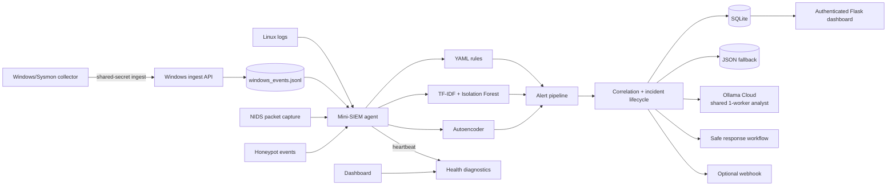

# Mini-SIEM Pro — AI-Assisted Blue Team Lab


A compact, explainable SIEM lab for learning blue-team workflows. It combines YAML signatures, local anomaly models, event correlation, an optional Ollama Cloud analyst, an authenticated incident dashboard, and safe response simulation.

> **Educational use only.** Run it only on systems and networks you own or are authorized to monitor. It is not a production EDR, firewall, or replacement for a staffed SOC.

## What is implemented

- YAML detection rules with MITRE ATT&CK mappings and reloadable rule state.
- HIDS log monitoring, Linux-oriented packet capture, honeypot events, and multi-event correlation.
- Offline Windows/Sysmon import plus authenticated collector ingestion.
- TF-IDF/Isolation Forest and autoencoder anomaly signals alongside deterministic rules.
- Ollama Cloud triage through one shared worker; detection continues while the worker is busy or AI is unavailable.
- SQLite as the primary alert store, with JSON dual-write/fallback during migration.
- Incident lifecycle, notes, assignee, timeline, audit trail, role-based access, and CSRF protection.
- Proposed response actions, approvals, simulation, rollback metadata, and optional webhook notifications.
- Health/status diagnostics, retention, SQLite backup, and log rotation tooling.

## Architecture



The dashboard and agent share mounted `data/`, `logs/`, `models/`, and read-only rule files when run with Docker Compose.

## Detection and severity model

The local detector remains authoritative. AI enrichment never silently rewrites the alert's `severity`.

| Local evidence | System decision |
|---|---|
| YAML rule plus both local ML signals | `CRITICAL` |
| YAML rule plus one local ML signal | Keep the rule severity and annotate the supporting signal |
| No rule, both local ML signals, confidence at least 40 | `CRITICAL` |
| No rule, one local ML signal | `HIGH` |

Ollama adds separate decision-support fields:

- `ai_recommended_severity` and `ai_disposition`, without changing `severity`.
- `escalate_to_human=true` recommends `CRITICAL` and human review.
- A high-confidence false-positive assessment (`fp_confidence >= 80`) recommends `LOW` with `FALSE_POSITIVE_SUSPECTED`; an analyst still makes the final decision.

## Quick start with Docker

Requirements: Docker Desktop with Compose, Git, and enough resources to run the local models. Ollama Cloud is optional.

```bash
git clone <repository-url>
cd Mini-SIEM
cp .env.example .env
docker compose --profile train run --rm train
docker compose up -d
```

Create the first dashboard administrator. The command prompts securely when `DASHBOARD_USER_PASSWORD` is not set:

```bash
docker compose exec dashboard python tools/manage_dashboard_user.py admin admin
```

Open <http://localhost:5000>, then sign in. Check service state with:

```bash
docker compose ps
curl http://localhost:5000/health
```

The local rule/ML pipeline works without an Ollama key. Training only needs to be rerun when models or training data change.

## Ollama Cloud setup

Copy `.env.example` to `.env` and set:

```dotenv
AI_PROVIDER=ollama_cloud
OLLAMA_API_KEY=your_ollama_cloud_key
OLLAMA_BASE_URL=https://ollama.com/api
OLLAMA_MODEL=gemma4:cloud
```

The analyst uses one shared worker because the configured Ollama service accepts one request at a time. If it is occupied, new eligible alerts are marked `busy` instead of building an unbounded queue. AI failures do not block alert creation.

The validated AI payload contains:

```text
is_false_positive, fp_confidence, threat_confidence,
mitre_tactic, mitre_technique, threat_summary,
observed_facts, analyst_inferences, recommended_playbook,
ioc_tags, escalate_to_human
```

Provider, model, analysis time, cache state, and the separate severity recommendation are added by the application. The dashboard system-status view reports AI availability and recent outcomes without making a probe call that would occupy the worker.

## Dashboard roles

| Role | Access |
|---|---|
| `viewer` | View alerts, incidents, graphs, logs, and diagnostics |
| `analyst` | Viewer access plus incident status, assignee, notes, and response workflow |
| `admin` | Analyst access plus user/rule administration and maintenance-sensitive controls |

Sessions use HTTP-only cookies, server-side role checks, CSRF protection for mutations, and an append-only analyst audit log. Set `DASHBOARD_SESSION_SECRET` explicitly for stable deployments and enable `DASHBOARD_COOKIE_SECURE=true` only behind HTTPS.

## Response safety

`RESPONSE_MODE=simulation` is the default. Actions such as `BLOCK_IP`, `ISOLATE_HOST`, and `DISABLE_USER` are proposed and audited but do not alter the host. Protected targets, approval expiry, execution records, and rollback metadata remain enforced by the workflow.

This repository does not execute arbitrary AI-generated commands. Treat manual or automatic modes as workflow labels for the lab until a separately reviewed, least-privilege executor is integrated.

Optional high-risk notifications can be sent to a generic or Discord webhook. Leave `NOTIFICATION_WEBHOOK_URL` empty to disable them.

## Windows and Sysmon collection

Offline exports (`.json`, `.jsonl`, `.ndjson`, `.xml`, or `.evtx`) can be normalized with:

```bash
python tools/import_windows_events.py evidence.evtx --output data/windows_events.jsonl
```

For continuous collection, run `tools/windows_event_collector.ps1` on the Windows host and configure the same random `WINDOWS_COLLECTOR_SECRET` on the collector and dashboard. The current mappings focus on selected Sysmon process, network, image-load, access, file, and registry events plus selected Security/Defender events.

Limitations:

- The collector is polling-based and intentionally covers a blue-team lab subset, not every Windows event channel or Sysmon event ID.
- Event access depends on Windows privileges, channel availability, and the local Sysmon configuration.
- Transport should be placed behind HTTPS before it crosses an untrusted network; a shared secret alone does not encrypt traffic.

## NIDS limitations on Windows and Docker Desktop

The Compose agent uses host networking and privileged packet capture, which is primarily a Linux configuration. On native Windows, packet capture generally requires Npcap and an elevated process. Under Docker Desktop, the agent normally observes networking visible inside its Linux VM/container environment, not every packet on the physical Windows host.

For meaningful NIDS testing, prefer a Linux host/VM with an explicitly selected interface or feed mirrored traffic to a dedicated sensor. Keep HIDS and Windows event collection enabled when full host packet visibility is unavailable.

## Operations and testing

- `GET /health` provides an unauthenticated liveness/readiness summary; authenticated admins can use `/api/system/status` for richer diagnostics.
- Retention, backup, restore verification, and log rotation are documented in [Retention and backup](docs/RETENTION_BACKUP.md).
- Detection coverage and manual checks are tracked in [Detection checklist](DETECTION_CHECKLIST.md).
- The development history and batch plan are in [Blue-team development plan](MINI_SIEM_BLUE_TEAM_DEVELOPMENT_PLAN.md).

Useful commands:

```bash
# Run the automated test suite in the existing image
docker compose run --rm -v "${PWD}:/app" dashboard python -m unittest discover -s tests

# Generate authorized lab traffic/events
docker compose exec agent python tools/attack_sim.py

# Back up SQLite or apply retention offline
docker compose run --rm dashboard python -m tools.maintenance backup
docker compose run --rm dashboard python -m tools.maintenance retention --days 90
```

## Project layout

```text
Mini-SIEM/
├── config/rules/                 # YAML detections and MITRE metadata
├── docs/                         # Operational runbooks
├── models/                       # Trained local anomaly models
├── src/                          # Detection, storage, AI, response, and health modules
├── static/ and templates/        # Authenticated Flask dashboard
├── tests/                        # Regression and workflow tests
├── tools/                        # Training, import, users, rules, maintenance, simulation
├── dashboard.py                  # Dashboard/API entry point
├── main.py                       # Sensor/agent entry point
└── docker-compose.yml
```

## Dashboard


## Near-term roadmap

- A repeatable end-to-end demo scenario and release checklist.
- TLS/reverse-proxy deployment guidance and stronger secret management.
- Shared coordination state for multi-process or multi-node deployments.
- Production-grade response integrations, after explicit approval and least-privilege design.

Contributions should keep detections explainable, failure modes observable, and response actions safe by default.
